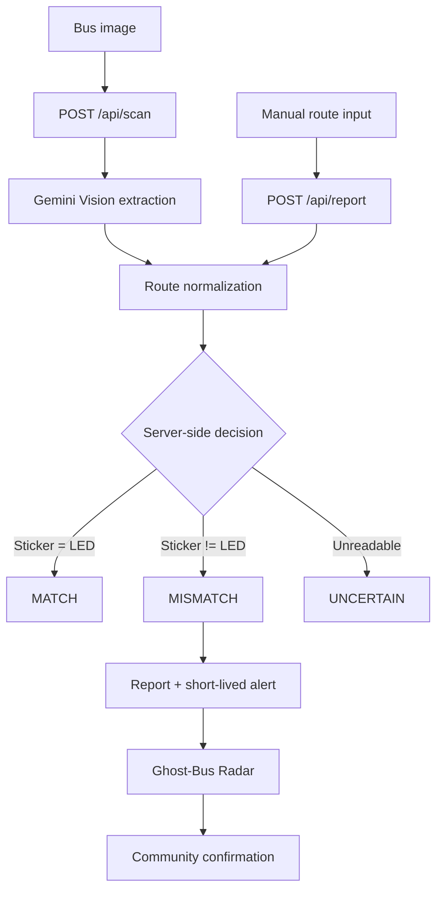

<div align="center">

# 🚌 TransitFlow

### AI-assisted, community-powered bus route verification and ghost-bus alerts

**AI extracts the evidence. Deterministic server logic decides the verdict.**


</div>

---

## 📖 Overview

A bus may **claim one route** on its windshield sticker while its front LED display **shows another**. For example, a bus could carry a sticker reading `102` while its LED display reads `102A`. A passenger may rely on one identifier and discover the discrepancy only after boarding.

**TransitFlow** turns that single commuter observation into a shared, short-lived transit signal:

1. A commuter photographs the bus or enters the two route numbers manually.
2. **Gemini Vision** extracts the windshield/sticker route and the LED route from the image.
3. The **backend independently normalizes and compares** those readings.
4. A mismatch can become a **location-aware, time-bounded ghost-bus alert**.
5. Other commuters can **confirm** the sighting.
6. The **Ghost-Bus Radar** exposes active alerts to nearby users.

> **The client never declares the verdict. The server is the single authoritative decision point.**

TransitFlow is intentionally designed so that the core verification pipeline still works in **manual mode without a Gemini API key**.

## 📚 Table of Contents

- [Overview](#-overview)
- [Key Features](#-key-features)
- [How It Works](#-how-it-works)
- [Architecture](#-architecture)
- [Tech Stack](#-tech-stack)
- [Repository Structure](#-repository-structure)
- [Getting Started](#-getting-started)
- [Environment Variables](#-environment-variables)
- [API Reference](#-api-reference)
- [Security and Integrity](#-security-and-integrity)
- [CI/CD](#-cicd)
- [Deployment Intent](#-deployment-intent)
- [Android Client Status](#-android-client-status)
- [Roadmap](#-roadmap)
- [Contributing](#-contributing)
- [License](#-license)
- [Project Team](#-project-team)

---

## ✨ Key Features

| Feature | Description |
|---|---|
| 📷 **AI route extraction** | Gemini Vision reads sticker and LED route indicators from a bus photo and returns structured JSON. |
| ⚖️ **Deterministic verdicts** | Normalized comparison produces `MATCH`, `MISMATCH`, or `UNCERTAIN`; the LLM does not decide the final business verdict. |
| ✍️ **Manual fallback** | Users can enter both route values manually; the server applies the same decision logic without requiring Gemini. |
| 🚨 **Ghost-Bus Radar** | Active mismatch alerts are shown with a default **30-minute TTL**. |
| 📍 **Geospatial filtering** | Alerts can be filtered by route, stop, latitude/longitude and radius using Haversine distance. |
| 🤝 **Community confirmation** | Other users can confirm an observed mismatch, increasing the alert's confirmation count. |
| 🗺️ **Route and stop intelligence** | Local dataset containing **256 routes** and **284 unique stops**, with fuzzy stop matching. |
| 🛡️ **Abuse controls** | Image validation, per-endpoint rate limiting, configurable CORS, and server-side verdict calculation. |
| 💾 **Pluggable storage** | In-memory storage for simple development plus an optional Redis-backed store for durable shared state. |

---

## 🧠 How It Works

### Verdict model

| Input relationship | Result | Meaning |
|---|---|---|
| Sticker == LED | `MATCH` | Both indicators represent the same normalized route. |
| Sticker != LED | `MISMATCH` | The indicators represent different normalized routes. |
| One or both unreadable | `UNCERTAIN` | There is not enough evidence for a definitive decision. |

Normalization removes formatting noise without erasing meaningful route differences. For example, `102a`, `102 A`, and `102A` normalize to the same route token, while `102` and `102A` remain different.

### End-to-end pipeline



### AI responsibility vs. business responsibility

The AI layer is used for **perception**: reading what appears on the bus. Gemini is instructed to behave conservatively, preserve meaningful route suffixes such as `A`, `H`, and `M`, and return `null` when the evidence is insufficient.

The business rule lives in the backend domain layer. This separation makes the final verdict deterministic and testable.

### Example

| Step | System action |
|---|---|
| 1 | Commuter captures a bus image. |
| 2 | Frontend sends it to `POST /api/scan`. |
| 3 | Gemini extracts `stickerRoute=102`, `ledRoute=102A`. |
| 4 | Backend normalizes both identifiers. |
| 5 | Decision engine returns `MISMATCH`. |
| 6 | Commuter submits the report with optional stop and GPS context. |
| 7 | Backend stores the report and creates a 30-minute alert. |
| 8 | Nearby commuters see the alert on the radar. |
| 9 | Another commuter confirms the sighting. |

Example extraction payload:

```json
{
  "stickerRoute": "102",
  "ledRoute": "102A",
  "confidence": "HIGH"
}
```

---

## 🏗️ Architecture

```text
                         COMMUTER
                             │
                  Next.js / React client
                  /          |          \
             Camera       Manual       Location
                  \          |          /
                           REST API
                              │
                    Express + TypeScript
                              │
          ┌───────────────────┼───────────────────┐
          │                   │                   │
    Gemini Vision       Domain decision      Route / stop
      extraction        + normalization       intelligence
          │                   │                   │
          └───────────────────┼───────────────────┘
                              │
                       Report / Alert store
                         Memory | Redis
                              │
                       Ghost-Bus Radar
                              │
                    Community confirmation
```

### Backend layout

| Folder | Responsibility |
|---|---|
| `server/src/ai/` | Gemini Vision integration and structured extraction. |
| `server/src/domain/` | Core business rules, route normalization, verdict calculation, types and identifiers. |
| `server/src/data/` | Route and stop dataset indexing and lookup. |
| `server/src/routes/` | HTTP endpoints for scans, reports, alerts, routes, stops and system information. |
| `server/src/http/` | HTTP error handling and rate limiting. |
| `server/src/store/` | Persistence abstraction with in-memory and Redis implementations. |
| `data/routes.json` | Route dataset used for search, stop matching and expected-route context. |
| `scripts/scraper.py` | Route dataset refresh tooling. |

The API layer is intentionally unaware of which storage implementation is active. With no Redis configuration, development uses memory; setting `REDIS_URL` enables the Redis-backed store.

### Web client

The implemented web client is a mobile-first **Next.js 14 App Router** application. It talks to the backend through typed API definitions in `web/lib/api.ts`.

| Area | Purpose |
|---|---|
| **Radar** | Live mismatch alerts, route/stop filtering, proximity context and confirmations. |
| **Scan** | Camera/image selection, AI analysis, manual route entry, location capture and report submission. |
| **Routes** | Route search and route details. |
| **Profile** | Appearance preferences, saved routes and client settings. |
| **About** | Explains the TransitFlow concept. |

---

## 🧰 Tech Stack

| Layer | Technology |
|---|---|
| Backend runtime | Node.js 20+ |
| Backend language | TypeScript |
| Backend framework | Express.js 4 |
| AI / Vision | Google Gemini Vision API, default model `gemini-2.5-flash` |
| Web framework | Next.js 14 |
| Web UI | React 18 |
| Styling | Tailwind CSS 3 |
| Icons | Lucide React |
| Persistence | In-memory store or Redis via `ioredis` |
| Data | JSON route dataset (`data/routes.json`) |
| Automation / CI | GitHub Actions |
| Package management | npm |

## 📱 Android Client Status

The repository contains an Android module, but the **current Android source is not yet aligned with the TransitFlow web/API architecture**. The checked-in Android code is a Java/XML railway-oriented prototype using AndroidX AppCompat, Material Components, ConstraintLayout and the Navigation component.

The intended future TransitFlow Android client is a separate roadmap item rather than a claim about the current Android implementation.

---

## 📁 Repository Structure

```text
TransitFlow/
├── .github/                # GitHub Actions / repository automation
├── docs/                   # API, architecture and contribution documentation
├── android/                # Current Android module (needs TransitFlow alignment)
├── data/                   # Route dataset
├── scripts/                # Dataset refresh tooling
├── server/                 # Express + TypeScript Core API
│   └── .env.example        # Backend environment template
├── web/                    # Next.js + React web client
├── .env.example            # Root environment documentation/template
├── .gitignore              # Ignored dependencies, builds and local secrets
├── LICENSE                 # MIT License
├── package.json            # Root monorepo scripts
└── README.md               # Project documentation
```

Generated/local content such as `node_modules/`, `.env`, `.next/`, `dist/`, Android build outputs and IDE metadata should not be committed.

---

## 🚀 Getting Started

### Prerequisites

- Node.js 20 or newer
- npm
- A Google Gemini API key for AI image scanning (optional; manual mode works without it)
- Redis for durable shared storage (optional)

### 1. Clone the repository

```bash
git clone https://github.com/prithviraj3427/TransitFlow.git
cd TransitFlow
```

### 2. Install server and web dependencies

From the repository root:

```bash
npm run install:all
```

Or install each component individually:

```bash
cd server
npm ci

cd ../web
npm ci
```

### 3. Configure the backend

The backend template lives at `server/.env.example`. From the repository root, copy it to the local backend environment file:

```bash
cp server/.env.example server/.env
```

PowerShell equivalent:

```powershell
Copy-Item server/.env.example server/.env
```

Then set the required values for your environment.

### 4. Start the backend

From the repository root:

```bash
npm run dev:server
```

The API listens on:

```text
http://localhost:4000
```

### 5. Start the web client

From another terminal:

```bash
cd web
npm run dev
```

The web client runs on:

```text
http://localhost:3000
```

Point the web client at the API with `NEXT_PUBLIC_API_BASE` when needed.

### Root development commands

From the repository root:

```bash
npm run install:all
npm run dev:server
npm run dev:web
npm run build:server
npm run build:web
npm run typecheck:server
npm run android:debug
```

---

## 🔐 Environment Variables

### Server: `server/.env`

| Variable | Required | Description |
|---|---|---|
| `PORT` | No | API port; defaults to `4000`. |
| `GEMINI_API_KEY` | Optional | Enables image-based AI scanning. |
| `GEMINI_MODEL` | No | Gemini vision model; defaults to `gemini-2.5-flash`. |
| `REDIS_URL` | Optional | Enables Redis-backed durable storage. |
| `CORS_ORIGINS` | Recommended in production | Comma-separated list of allowed web origins. |
| `DATA_PATH` | No | Optional override for the route dataset path. |
| `ALERT_TTL_MINUTES` | No | Alert lifetime; defaults to `30`. |

### Web: `web/.env.local`

```env
NEXT_PUBLIC_API_BASE=http://localhost:4000
```

### Root environment documentation

The repository root also includes `.env.example` as a safe documentation template describing where each component's real environment file belongs. The backend's copyable template is `server/.env.example`; no production secrets are stored in either template.

> **Never commit `.env`, API keys, Redis credentials or other secrets.**

---

## 🔌 API Reference

The Core API is JSON-based and uses a consistent error shape:

```json
{
  "error": {
    "message": "Human-readable, safe to show to the user."
  }
}
```

### Scanning and reporting

| Method | Endpoint | Purpose |
|---|---|---|
| `POST` | `/api/scan` | Analyze a bus image and return AI extraction plus a server-side verdict. |
| `POST` | `/api/scans/:scanId/report` | Submit a report from an existing scan, optionally correcting readings and adding location. |
| `POST` | `/api/report` | Submit a fully manual report without a photo. |

### Radar and confirmation

| Method | Endpoint | Purpose |
|---|---|---|
| `GET` | `/api/alerts` | List active alerts, optionally filtered by route, stop or location/radius. |
| `POST` | `/api/alerts/:alertId/confirm` | Confirm that the user observed the reported mismatch. |

### Route and stop intelligence

| Method | Endpoint | Purpose |
|---|---|---|
| `GET` | `/api/routes` | Search routes by number, name or stop. |
| `GET` | `/api/routes/:routeNumber` | Get details for a specific route. |
| `GET` | `/api/stops` | Get stop names for lookup/autocomplete. |

### System

| Method | Endpoint | Purpose |
|---|---|---|
| `GET` | `/api/health` | Service health check. |
| `GET` | `/api/meta` | Service/model/storage metadata. |
| `GET` | `/api/stats` | Aggregate route, report and alert statistics. |

For complete request/response schemas, validation rules and status codes, see [`docs/API.md`](docs/API.md).

---

## 🛡️ Security and Integrity

- **Server-authoritative verdicts:** the client cannot declare `MATCH` or `MISMATCH`; the backend computes the result.
- **Image validation:** MIME type, image size and basic Base64/signature checks happen before an AI call.
- **Rate limiting:** scan, report and confirmation endpoints are rate-limited per IP.
- **CORS allow-list:** permitted browser origins are configurable per environment.
- **Secret isolation:** API keys and credentials remain in local environment configuration.
- **Short-lived alerts:** mismatch alerts expire after a configurable TTL rather than becoming permanent warnings.

---

## ⚙️ CI/CD

GitHub Actions validates three parts of the repository:

| Job | Checks |
|---|---|
| **Core API** | `npm ci`, TypeScript typecheck, production build and smoke requests to health/stats/routes endpoints. |
| **Web app** | `npm ci` and `next build`. |
| **Android** | Gradle `assembleDebug` and APK artifact upload. |

The repository uses GitHub Actions as the automated quality gate for pull requests and pushes to `main`. Workflow implementation details are kept in `.github/workflows/ci.yml`.

---

## 🌐 Deployment Intent

The project is designed around the following deployment model:

```text
Next.js web client  → Vercel
Express Core API    → Render or another Node-compatible host
Redis               → Upstash / compatible Redis service
```

These are deployment targets rather than a claim that production infrastructure is already configured.

---

## 🗺️ Roadmap

- [ ] Align or replace the current Android module with a true TransitFlow client.
- [ ] Production deployment of the web app, API and Redis-backed persistence.
- [ ] Expand route and stop coverage beyond the current dataset.
- [ ] Add automated unit tests around normalization and verdict logic.
- [ ] Add richer notification and alert-history features.
- [ ] Expand the platform to additional cities/datasets.

---

## 🤝 Contributing

Please read [`docs/CONTRIBUTING.md`](docs/CONTRIBUTING.md) for contribution rules, architecture boundaries, API ownership and the branch workflow.

Before opening a Pull Request, run the relevant typecheck and build commands locally and make sure CI can validate the changes.

---

## 📄 License

TransitFlow is distributed under the **MIT License**.

Copyright © 2025–2026 **Senthilnathan S. & Prithviraj Y. Patel (impact.exe)**.

See [`LICENSE`](LICENSE) for the full license text.

---

## 👤 Project Team

**Prithviraj Y Patel** — Frontend, client integration and project documentation  
GitHub: [@prithviraj3427](https://github.com/prithviraj3427)

**Senthilnathan S** — Backend, Core API and route-data tooling  
GitHub: [@senthilnathan627](https://github.com/senthilnathan627)

---

<div align="center">

**TransitFlow turns a single bus observation into a useful real-time transit signal.**

⭐ If this project is useful to you, consider giving it a star.

</div>
